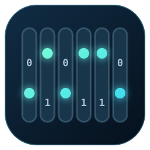

# Fun with Binary

A small interactive playground for learning how binary numbers work. The browser game asks the player to represent a decimal number using six binary switches; the active powers of two are added live until the target is reached.

[Play Fun with Binary](https://diogogithub.github.io/fun-with-binary/) · [Project write-up](https://blog.diogo.site/posts/fun-with-binary)



## What is included

- A responsive, dependency-free browser game.
- Keyboard controls (`1`–`6`) and accessible toggle buttons.
- Session recovery, completed-challenge count and streak tracking.
- Optional ESP8266 mode that mirrors the browser switches to six physical LEDs.
- The original ESP8266 captive-portal firmware in [`server/`](server/).

## Run locally

No build step is required:

```sh
python3 -m http.server 8080
```

Then open `http://localhost:8080`.

## Physical-device mode

The firmware creates the **Fun with Binary** Wi-Fi access point at `42.42.42.42`. When the page is served from that address, device mode is enabled automatically and the interface calls the existing `/switch_state` and `/won` endpoints.

For testing against a compatible device while serving the page elsewhere, append `?device=1` to the URL.

After editing `index.html`, `style.css` or `script.js`, regenerate the page embedded in the firmware:

```sh
python3 tools/build-embedded.py
```

This writes `server/file1.h`, which is served directly from program memory by the ESP8266.

## Original hardware

The original setup uses an ESP8266-compatible board, six LEDs, six resistors, a breadboard and wiring. Each browser bit corresponds to one physical LED.

## License

Copyright © 2018–2026 Diogo Cordeiro.

Fun with Binary is free software licensed under the GNU Affero General Public License, version 3 or any later version. See [`COPYING`](COPYING).
